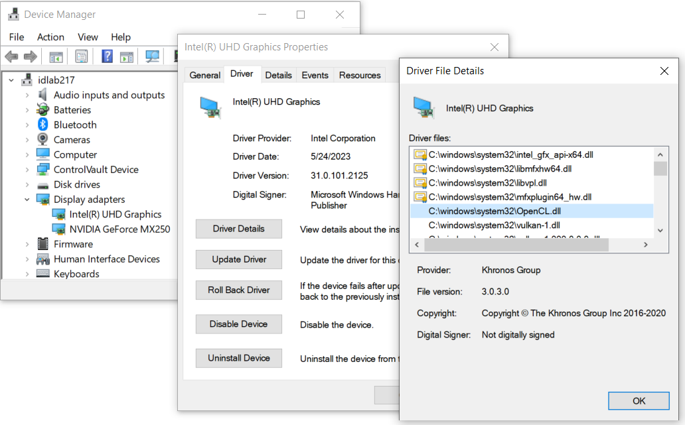
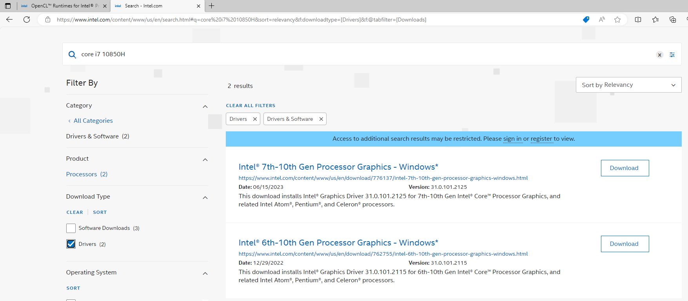

# Getting OpenCL to work

This document is geared toward getting OpenCL to work for CG-lab4. If you cannot get it to compile, build and run properly, even when following the instructions below, **leave an issue** [here](https://github.com/jlartois/installing-opencl/issues) **or send us an email**.

## NVidia
For those with an NVidia GPU, installing the CUDA Toolkit (and rebooting) seems to suffice to get OpenCL to work.

## Apple
For those with an Apple computer, OpenCL seems to work out of the box.

## AMD
1. Windows: OpenCL seems to be supported through the Adrenalin driver. _Has anyone tried this?_
2. Ubuntu 20.04 or 22.04: installing the ROCm packages seems to suffice. _Has anyone tried this?_

## Intel
### Windows
_I tested this on Windows and it works._

According to [this webpage](https://www.intel.com/content/www/us/en/developer/articles/tool/opencl-drivers.html#proc-graph-section), when scrolling down to "Windows* OS":
> Intel® Graphics Compute Runtime for OpenCL™ Driver is included with the Intel® Graphics Driver package for Windows* OS.
> 
> (...)
> 
> The graphics driver package is built in with Windows* 10 OS install.

This means that `OpenCL.dll` is likely already installed. `dll` means dynamically linked library, so it's only needed when running an OpenCL program, but not during compilation/building. Check if `OpenCL.dll` is installed in one of the following ways:
* Check if it is in `C:/Windows/System32`.
* Open the "Device Manager" > Display Adapters > right-click Intel Graphics > Driver > Driver details. You should see the `OpenCL.dll` file, like this:
  
  
If you do not see the Intel Graphics driver, or are missing `OpenCL.dll`, try to download the Graphics driver from the [Intel Download Center](https://www.intel.com/content/www/us/en/download-center/home.html). For example, I did this for my Intel Core i7-10850h (I downloaded the first one in the list):


Almost there, we just need the OpenCL C header, C++ headers and ICD Loader, which we will [build from source](https://github.com/KhronosGroup/OpenCL-CLHPP/tree/main) as follows:

Assuming that you have Visual Studio (or a different C++ compiler) installed, install [cmake (Windows x64 installer)](https://cmake.org/download/) for the command line, to make this easier. 

> For those not familiar with cmake on the command line, here are common command line arguments:
> ```
> cmake -S . -B build                # Run cmake to create a project, where CMakeLists.txt is in the "." directory (S for source), and "build" is the build directory (B)
>                                    # Corresponds to "mkdir build, cd build, cmake .." on unix.
> cmake --build ./build              # Build the project in the build folder. Corresponds to "make" on unix.
> cmake -D CMAKE_BUILD_TYPE=Debug    # "-D" is used to set parameters ("entries"), for example CMAKE_BUILD_TYPE
> ```

```
git clone --recursive https://github.com/KhronosGroup/OpenCL-CLHPP
git clone https://github.com/KhronosGroup/OpenCL-ICD-Loader
git clone https://github.com/KhronosGroup/OpenCL-Headers

# compile and build "OpenCL-Header", the results will be placed into "OpenCL-Header/install" 
cmake -D CMAKE_INSTALL_PREFIX=./OpenCL-Headers/install -S ./OpenCL-Headers -B ./OpenCL-Headers/build 
cmake --build ./OpenCL-Headers/build --target install

# idem "OpenCL-ICD-Loader"
# DONT FORGET TO CHANGE THE "/absolute/path/to" to the actual ABSOLUTE path
cmake -D CMAKE_PREFIX_PATH=/absolute/path/to/OpenCL-Headers/install -D CMAKE_INSTALL_PREFIX=./OpenCL-ICD-Loader/install -S ./OpenCL-ICD-Loader -B ./OpenCL-ICD-Loader/build 
cmake --build ./OpenCL-ICD-Loader/build --target install

# idem "OpenCL-CLHPP"
cmake -D CMAKE_PREFIX_PATH="/absolute/path/to/OpenCL-Headers/install;/absolute/path/to/OpenCL-ICD-Loader/install" -D CMAKE_INSTALL_PREFIX=./OpenCL-CLHPP/install -S ./OpenCL-CLHPP -B ./OpenCL-CLHPP/build 
cmake --build ./OpenCL-CLHPP/build --target install
```
`clinfo` and CG-lab4 should now work, if `CMAKE_PREFIX_PATH` is correctly passed to CMake:
```
# navigate to where you downloaded CG-lab4
cd path/to/CG-lab4
cd clinfo
cmake -D CMAKE_PREFIX_PATH="/absolute/path/to/OpenCL-Headers/install;/absolute/path/to/OpenCL-ICD-Loader/install;/absolute/path/to/OpenCL-CLHPP/install" -S . -B build
cmake --build ./build
```
A working `clinfo.exe` should now be in a subdirectory of `build/`. Follow the same steps to build CG-lab4.

### Ubuntu 22.04, also WSL with Ubuntu 22.04
_I tested this on a fresh Ubuntu and WSL, and it works for me._
```
sudo apt update -y
sudo apt full-upgrade -y
sudo apt install clinfo
clinfo                         # returns 0 platforms
sudo apt install ocl-icd-opencl-dev -y
sudo apt install opencl-headers

# to test if libOpenCL.so is properly installed:
sudo apt install apt-file -y   # to find files
sudo apt-file update           # necessary
apt-file find libOpenCL.so     # returns 4 results, including:
                               # ocl-icd-libopencl1: /usr/lib/x86_64-linux-gnu/libOpenCL.so.1
                               # ocl-icd-opencl-dev: /usr/lib/x86_64-linux-gnu/libOpenCL.so
                               # so that's good

clinfo                         # still returns 0 platforms
```

Since clinfo is still not detecting OpenCL, we need to install the Intel runtimes as follows. Go to [this webpage](https://www.intel.com/content/www/us/en/developer/articles/tool/opencl-drivers.html#proc-graph-section) and scroll down to "Linux* OS". Check if gcc is installed:

```
sudo apt install gcc g++ -y   # install gcc, g++ if this was not already the case
gcc --version                 # returns 11.4, which is >=7.3
```
We checked earlier if libOpenCL.so was installed. So lastly click [Manual Download and install](https://github.com/intel/compute-runtime/releases) and scroll down to "Installation procedure on Ubuntu 22.04". Follow the instructions:
```
mkdir neo
cd neo
wget ...                      # wget the 7 .deb files
sudo dpkg -i *.deb
```
That's it, normally clinfo should work now:
```
clinfo                        # now works and returns 1 platform: Intel(R), OpenCL 3.0
```
Compiling, building and runing CG-lab4 should also work.

## Other Linux distros
Check out the first paragraph in the [FAQ](https://github.com/intel/compute-runtime/blob/master/FAQ.md) of the Intel runtimes repository. It elaborates on the supported OS's.

_I have not tested this. Did the instructions above work for you, or not?_
